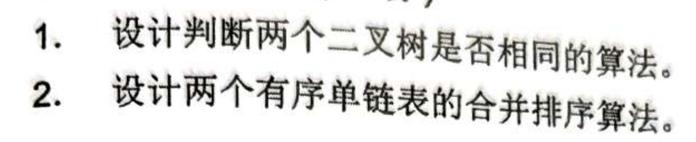
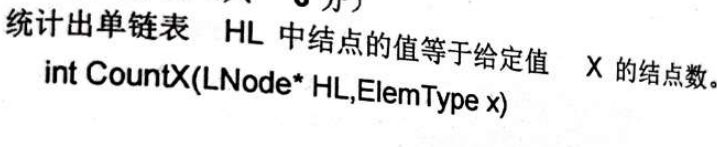
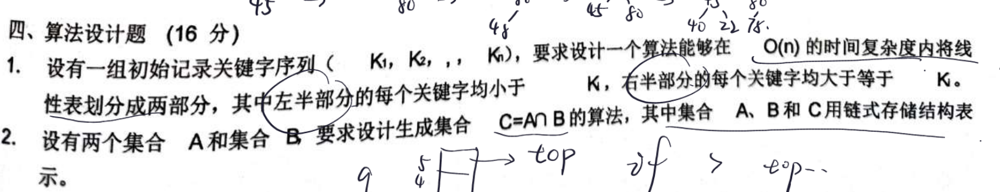
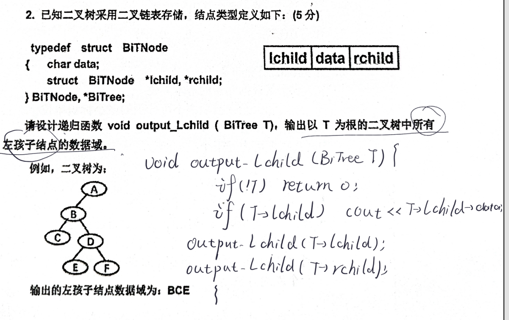
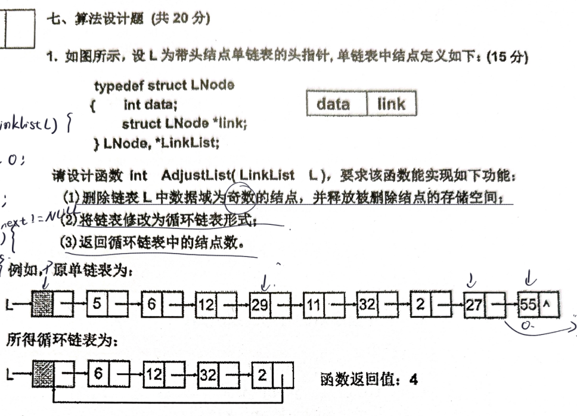

```
bool isSame(Bitree* a, Bitree* b) {
    // 1. 如果都为空，显然相同
    if (a == NULL && b == NULL) return true;
    
    // 2. 如果一个为空另一个不为空，显然不同
    if (a == NULL || b == NULL) return false;
    
    // 3. 都不为空，则必须满足：当前值相等 且 左子树相同 且 右子树相同
    return (a->data == b->data) && 
           isSame(a->lchild, b->lchild) && 
           isSame(a->rchild, b->rchild);
}
```
```
// 假设链表定义如下：
typedef struct LNode {
    int data;
    struct LNode *next;
} LNode, *LinkList;

LinkList merge(LinkList a, LinkList b) {
    LNode dummy;       // 虚拟头结点
    LNode *tail = &dummy; // 尾指针，用来挂载合并后的结点
    dummy.next = NULL;

    while (a != NULL && b != NULL) {
        if (a->data <= b->data) {
            tail->next = a;  // 把较小的 a 挂在尾部
            a = a->next;     // a 指针后移
        } else {
            tail->next = b;  // 把较小的 b 挂在尾部
            b = b->next;     // b 指针后移
        }
        tail = tail->next;   // 尾指针后移
    }

    // 链接剩余的链表
    if (a != NULL) {
        tail->next = a;
    } else {
        tail->next = b;
    }

    return dummy.next; // 返回合并后的新链表头
}
```

```
// 假设单链表结点的结构体定义如下（考试时可写可不写，写出来是加分项）：
// typedef struct LNode {
//     ElemType data;
//     struct LNode *next;
// } LNode;

int CountX(LNode* HL, ElemType x) {
    int count = 0;          // 1. 初始化计数器
    LNode* p = HL->next;    // 2. 指向第一个存放数据的结点（假设链表带头结点）
    
    // 如果您的学校教材中单链表默认【不带头结点】，请将上面一行改为：
    // LNode* p = HL; 

    while (p != NULL) {     // 3. 遍历整个单链表
        if (p->data == x) { // 4. 如果结点值等于给定值 x
            count++;        // 计数器加 1
        }
        p = p->next;        // 指针后移，指向下一个结点
    }
    
    return count;           // 5. 返回统计结果
}
```

透过题面看本质:第一题就是一趟快速排序
```
// 假设顺序表定义如下：
typedef struct {
    int data[MAXSIZE];
    int length;
} SqList;

void Partition(SqList *L) {
    if (L == NULL || L->length <= 1) return;

    int pivot = L->data[0]; // 以 K1 作为枢轴
    int low = 0;
    int high = L->length - 1;

    while (low < high) {
        // 1. 从右向左找第一个小于 pivot 的元素
        while (low < high && L->data[high] >= pivot) {
            high--;
        }
        L->data[low] = L->data[high]; // 将其移到左边

        // 2. 从左向右找第一个大于等于 pivot 的元素
        while (low < high && L->data[low] < pivot) {
            low++;
        }
        L->data[high] = L->data[low]; // 将其移到右边
    }

    L->data[low] = pivot; // 枢轴元素归位
}
```

```
这个比较简单
```

```
int AdjustList(LinkList L) {
    if (!L) return 0;  // 健壮性检查：如果链表指针本身为空，返回0
    
    LinkList p = L;
    int count = 0;
    
    while (p->link != NULL) {
        // 1. 判断是否为奇数（用 != 0 兼容负奇数）
        if (p->link->data % 2 != 0) { 
            LinkList q = p->link;     // 暂存待删除结点
            p->link = q->link;        // 从链表中切断该结点
            free(q);                  // 2. 释放被删除结点的内存空间
            // 注意：删除结点后，p 不需要后移，下一次循环继续检查新的 p->link
        } 
        else {
            count++;                  // 偶数结点计数加 1
            p = p->link;              // p 后移
        }
    }
    
    p->link = L;                      // 3. 首尾相接，修改为循环链表
    return count;
}
//要考虑的事:要释放内存;要考虑负奇数; 去掉 L->link == NULL 的直接返回，让其进入循环。即使没有结点，最后执行 p->link = L 也能正确地让空表自我循环。
```