1. 这种题怎么做? 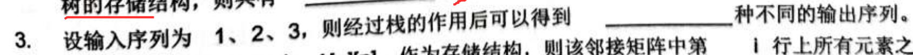
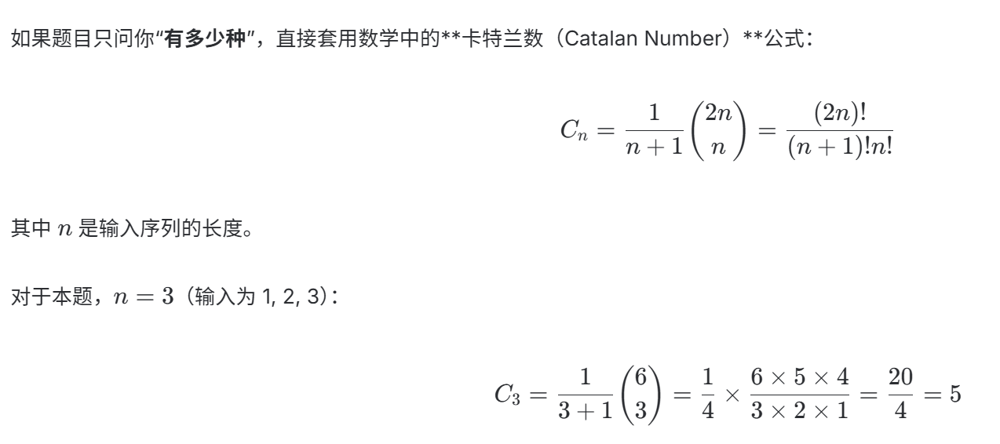

2. 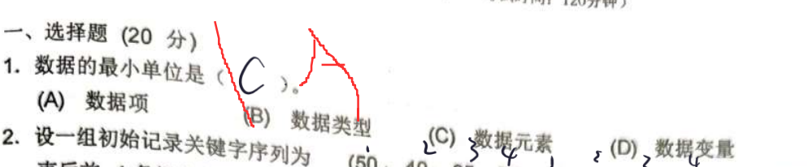
3. 二分查找:mid是向下取整.
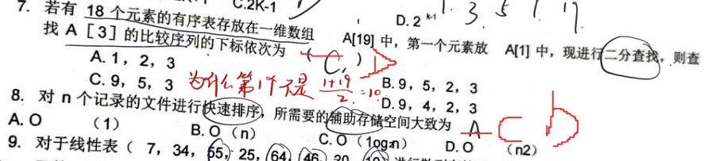
另外注意, 快速排序一趟和全部的空间复杂度的区别
4. 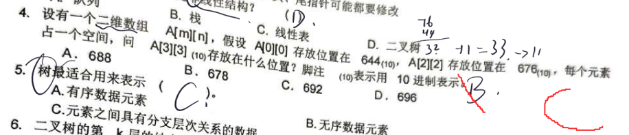 
先求出来列数 再数格子即可, 一个格子是一个位置
5. 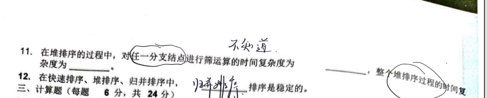
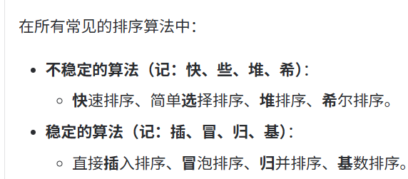
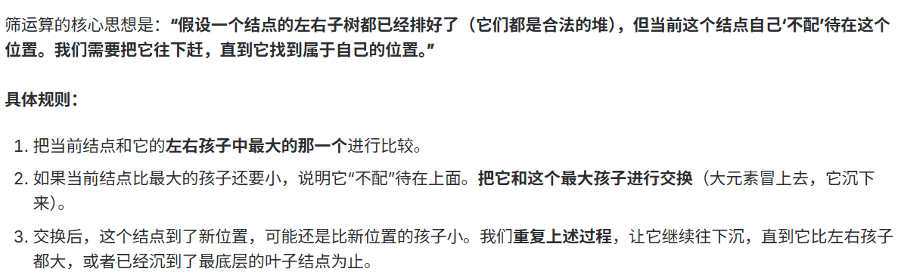
6. 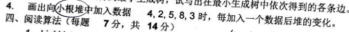
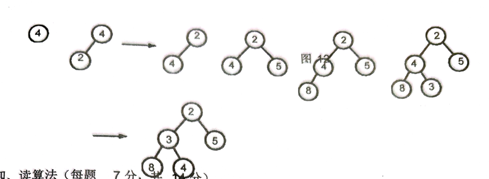
7. 队列中:
   头指针:先插入的元素所在位置
   尾指针:后插入的元素所在位置
8. 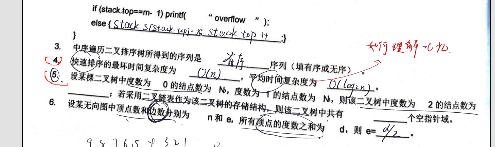

### **第 4 题：快速排序的时间复杂度（纠错与记忆）**

**注意**：试卷上铅笔写的答案（最坏 $O(n)$，平均 $O(\log_2 n)$）是**错误**的。请千万不要这样记忆。

#### **1. 正确答案**
* 快速排序的**最坏**时间复杂度为：**$O(n^2)$**
* 快速排序的**平均**时间复杂度为：**$O(n \log_2 n)$** （或写成 $O(n \log n)$）

---

#### **2. 如何理解与记忆？（回答图中的“如何理解记忆”）**

快速排序的核心思想是**分治法**：每次选一个“基准元素（Pivot）”，把比它小的放左边，比它大的放右边，然后递归。

##### **① 为什么平均是 $O(n \log_2 n)$？（最理想状态）**
* **理解**：如果每次“基准元素”都能完美地把数组**对半分**，那么递归树的高度就是 $\log_2 n$。
* 在递归树的每一层，我们都需要对所有元素进行一次比较和移动，耗时是 $O(n)$。
* **计算**：$\text{树的高度} \times \text{每层的工作量} = \log_2 n \times n = O(n \log_2 n)$。

##### **② 为什么最坏是 $O(n^2)$？（最糟糕状态）**
* **理解**：如果输入的序列**已经是有序的（升序或降序）**，且我们每次都雷打不动地选第一个元素当基准。
* 这时，每次划分都极其不均匀：一边是 $0$ 个元素，另一边是 $n-1$ 个元素。
* 此时递归树退化成了一条**单支树（类似于单链表）**，树的高度变成了 $n$。
* **计算**：第一层比较 $n$ 次，第二层 $n-1$ 次……最后一层 $1$ 次。
  $$n + (n-1) + (n-2) + \dots + 1 = \frac{n(n+1)}{2} = O(n^2)$$
* **记忆口诀**：**快排“怕”有序**。遇到有序序列，快排就退化成了冒泡排序，变成 $O(n^2)$。

---

### **第 5 题：二叉树的结点关系与空指针域计算**

这道题包含两个空格，考察的是二叉树的两个经典定理。

#### **第一空：度数为 2 的结点数**
* **定理**：在任意二叉树中，叶子结点数（度为 0 的结点数 $N_0$）总是比度为 2 的结点数 $N_2$ 多 1 个。
* **公式**：$$N_2 = N_0 - 1$$
* **证明过程**（可以不记，但有助于理解）：
  设总结点数为 $N$，总边数为 $B$。
  1. 从“结点”角度看：$N = N_0 + N_1 + N_2$
  2. 从“边”的角度看，除了根结点外，每个结点上方都有一条边相连，所以：$B = N - 1$
  3. 边是由度为 1 和度为 2 的结点发射出来的：$B = N_1 + 2N_2$
  4. 联立以上等式：$N_1 + 2N_2 = N_0 + N_1 + N_2 - 1 \implies N_2 = N_0 - 1$。
* **答案**：**$N_0 - 1$**

---

#### **第二空：二叉链表中的空指针域个数**
* **结论**：若二叉树有 $N$ 个结点，则采用二叉链表存储时，必有 **$N + 1$** 个空指针域。
* **如何表示成题目要求的参数**：
  因为 $N = N_0 + N_1 + N_2$，且我们已知 $N_2 = N_0 - 1$。
  代入得：$N = N_0 + N_1 + (N_0 - 1) = 2N_0 + N_1 - 1$。
  所以空指针个数 $N + 1 = \mathbf{2N_0 + N_1}$。

* **直观理解法（极力推荐此记忆法）**：
  * **度为 0 的结点（叶子 $N_0$）**：左右指针都为空，贡献 $2 \times N_0$ 个空指针。
  * **度为 1 的结点（$N_1$）**：只有一个孩子，另一个指针为空，贡献 $1 \times N_1$ 个空指针。
  * **度为 2 的结点（$N_2$）**：左右都有孩子，贡献 $0$ 个空指针。
  * 累加起来，空指针的总数就是：**$2N_0 + N_1$**。

* **答案**：**$2N_0 + N_1$**（或写成 **$N + 1$**，其中 $N$ 为总结点数）

9. 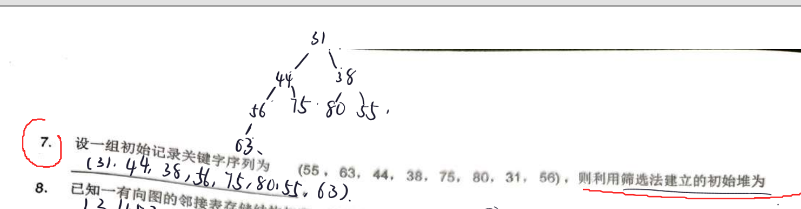
    我建立的堆为什么不对?
这是一个在学习数据结构时非常经典且容易混淆的错误。

你建立的堆之所以不对，是因为你使用了**“逐个插入法”（Insertion Method）**，而题目要求的是使用**“筛选法”（Sifting/Filtering Method，也称自底向上建堆法）**。

虽然你最后画出的二叉树确实是一个合法的最小堆，但**建堆的过程和方法错了**，导致最终得到的序列顺序与标准答案不一致。

---

### **为什么你的方法是“插入法”？**

如果我们把原始序列 `(55, 63, 44, 38, 75, 80, 31, 56)` 按照**一个接一个插入**到空堆中的方式：
1. 插入 55
2. 插入 63
3. 插入 44 $\rightarrow$ 调整
4. 插入 38 $\rightarrow$ 调整
…… 依此类推。
这样最终确实会得到你写的序列：`(31, 44, 38, 56, 75, 80, 55, 63)`。但这不是**筛选法**。

---

### **什么是“筛选法”（自底向上建堆）？**

筛选法的核心是：**先将所有初始数据直接排成一棵完全二叉树，然后从“最后一个非叶子结点”开始，自底向上、往下方进行筛选调整。**

我们以建立**最小堆**为例，演示正确的筛选法步骤：

#### **第一步：直接画出初始完全二叉树**
按照原始序列 `(55, 63, 44, 38, 75, 80, 31, 56)` 的顺序，直接填入二叉树中（括号内为数组下标）：

```text
            55 [1]
          /        \
       63 [2]       44 [3]
      /    \        /    \
    38 [4] 75 [5] 80 [6] 31 [7]
   /
 56 [8]
```

#### **第二步：找到最后一个非叶子结点**
总节点数 $n = 8$，最后一个非叶子结点的下标为 $\lfloor 8/2 \rfloor = 4$，即值为 **38** 的结点。我们从这个结点开始，**倒序（下标从 4 到 1）**进行向下筛选。

---

#### **第三步：逐步向下调整（筛选）**

##### **1. 调整下标为 4 的结点（值为 38）**
* 它的孩子只有 56。因为 $38 < 56$，符合最小堆性质，无需调整。

##### **2. 调整下标为 3 的结点（值为 44）**
* 它的孩子有 80 和 31。
* 两个孩子中较小的是 **31**。
* 因为 $44 > 31$，所以将 44 与 31 交换。
* 此时右子树变为：以 31 为父结点，80 和 44 为左右孩子。
* 调整后的局部树：
```text
            55
          /    \
       63        31
      /  \      /  \
    38    75  80    44
   /
 56
```

##### **3. 调整下标为 2 的结点（值为 63）**
* 它的孩子有 38 和 75。较小的是 **38**。
* 因为 $63 > 38$，将 63 与 38 交换。
* 交换后，63 来到了下标 4 的位置。它的孩子是 56。
* 因为 $63 > 56$，继续将 63 与 56 交换。
* 调整后的整体树：
```text
            55
          /    \
       38        31
      /  \      /  \
    56    75  80    44
   /
 63
```

##### **4. 调整下标为 1 的结点（根结点，值为 55）**
* 它的孩子有 38 和 31。较小的是 **31**（右孩子）。
* 因为 $55 > 31$，将 55 与 31 交换。
* 交换后，55 来到了原 31 的位置（下标 3）。它的孩子是 80 和 44。
* 两个孩子中较小的是 **44**。
* 因为 $55 > 44$，继续将 55 与 44 交换。
* 调整后的最终树：
```text
            31
          /    \
       38        44
      /  \      /  \
    56    75  80    55
   /
 63
```

---

### **最终答案**

#### **如果你建立的是最小堆（Min-Heap）：**
按层次遍历最终树，正确的初始堆序列为：
$$\mathbf{(31, 38, 44, 56, 75, 80, 55, 63)}$$
*(对比你的答案 `31, 44, 38...`，可以看到根结点的左右孩子顺序正好反了，这就是因为调整根结点 55 时，它必须与更小的右孩子 31 交换，从而保留了左孩子 38，而你通过插入法把 44 挤到了左边)*

#### **如果你建立的是最大堆（Max-Heap）：**
如果学校教材默认是用最大堆，用同样的筛选法步骤，最后得到的序列应为：
$$\mathbf{(80, 75, 55, 56, 63, 44, 31, 38)}$$

### **总结记忆**
* **逐个插入法**：从空树开始，每插入一个节点都**向上（Sift Up）**调整。
* **筛选法（考试常考）**：先排满整棵树，然后从最后一非叶子节点开始，**向下（Sift Down）**调整。
10. 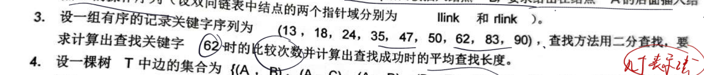
    注意ASL怎么算即可. ASL = (1\*1 + 2\*2 + 3\*4 + 4\*2)/9
11. 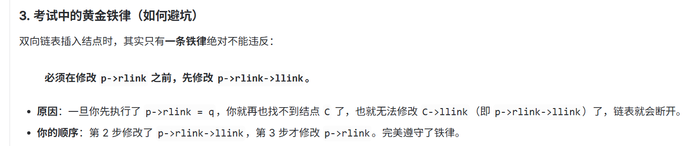
12. 树的三种存储结构
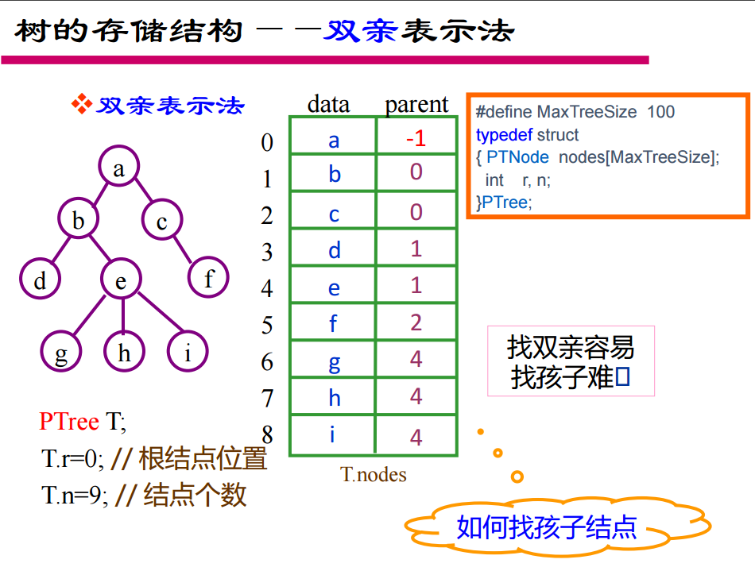
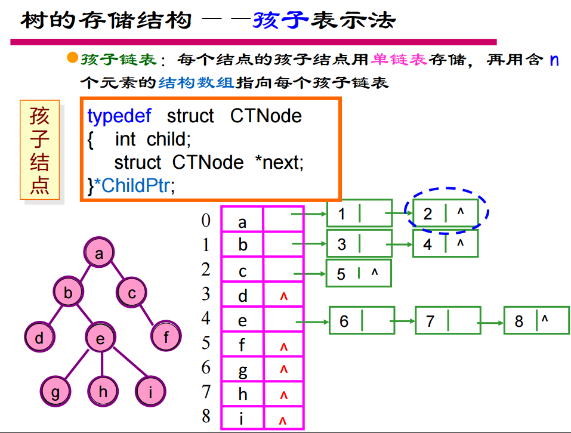
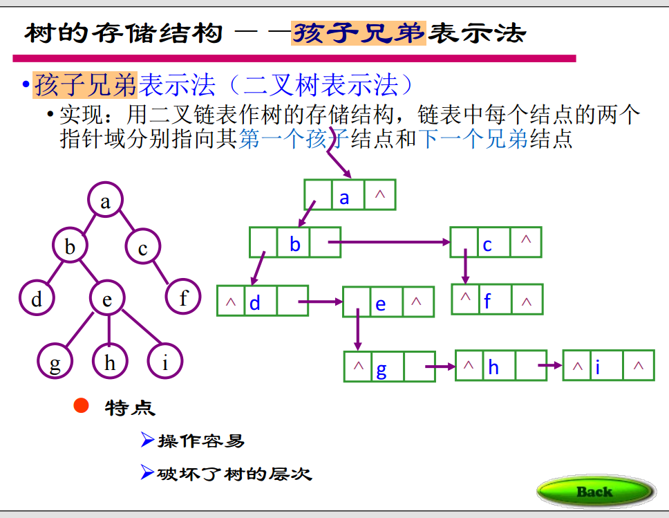
13. 生成树?
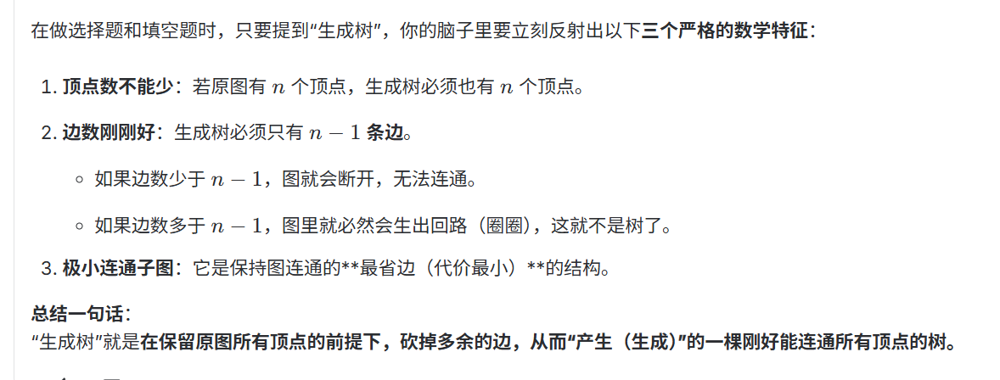
14. 

### **$m$ 叉树的通用定理推导过程**

#### **i. 从“结点”角度看**
整棵树的总结点数 $N$，是所有不同度数结点数的总和：
$$N = N_0 + N_1 + N_2 + N_3 + \dots + N_m$$

#### **ii. 从“边”的角度看（第一种算边方法）**
除了根结点外，树中的每一个结点上方都对应着唯一的一条边（指向它的双亲）。所以总边数 $B$ 为：
$$B = N - 1$$

#### **iii. 从“度”的角度看（第二种算边方法）**
边是由每个结点向下发射出来的。
* 度数为 $0$ 的结点发射出 $0$ 条边；
* 度数为 $1$ 的结点发射出 $1$ 条边；
* 度数为 $2$ 的结点发射出 $2$ 条边；
* ……
* 度数为 $m$ 的结点发射出 $m$ 条边。

所以，总边数 $B$ 还可以表示为：
$$B = 0 \cdot N_0 + 1 \cdot N_1 + 2 \cdot N_2 + 3 \cdot N_3 + \dots + m \cdot N_m$$
简化后为：
$$B = N_1 + 2N_2 + 3N_3 + \dots + m \cdot N_m$$

#### **iv. 联立以上等式**
因为两种方法算出来的总边数 $B$ 必须相等，所以：
$$(N_1 + 2N_2 + 3N_3 + \dots + m \cdot N_m) = N - 1$$

我们将第一步的 $N = N_0 + N_1 + N_2 + \dots + N_m$ 代入等式右边：
$$N_1 + 2N_2 + 3N_3 + \dots + m \cdot N_m = (N_0 + N_1 + N_2 + N_3 + \dots + N_m) - 1$$

现在，我们把等式两边相同的项消掉（两边同时减去 $N_1 + N_2 + N_3 + \dots + N_m$）：
* 左边：所有的系数都减去 1（例如 $2N_2$ 变成 $1N_2$，$3N_3$ 变成 $2N_3$，依次类推）。
* 右边：只剩下 $N_0 - 1$。

最后得到的**通用定理公式**为：
$$N_0 - 1 = N_2 + 2N_3 + 3N_4 + \dots + (m-1)N_m$$

移项整理，得到叶子结点数 $N_0$ 的通用表达式：
$$\mathbf{N_0 = 1 + \sum_{i=2}^{m} (i - 1)N_i}$$

---

### **如何理解和记忆这个推广公式？**

我们把具体数值代入进去看，就会发现它非常工整：

*   **对于二叉树 ($m = 2$)**：
    $$N_0 = 1 + (2-1)N_2 \implies N_0 = 1 + N_2 \implies N_2 = N_0 - 1$$
    （这就是你之前做的那道题！）

*   **对于三叉树 ($m = 3$)**：
    $$N_0 = 1 + N_2 + 2N_3$$
    （叶子结点数，等于 $1$ 加上“度为2的结点数”，加上“$2$ 倍度为3的结点数”）

*   **对于四叉树 ($m = 4$)**：
    $$N_0 = 1 + N_2 + 2N_3 + 3N_4$$

**考前记忆窍门**：
度数为 $i$ 的结点，它对叶子结点的“贡献权重”就是 **$(i-1)$**。你只需要记住每个结点的系数是 **“它的度数减 1”**，最后再统一加上最开始的根结点（那额外的 $+1$）即可。
15. 在数据结构考试中，求解最小生成树（Minimum Spanning Tree, MST）最经典且最常考的算法有两个：**普里姆（Prim）算法**和**克鲁斯卡尔（Kruskal）算法**。


### 1. 普里姆（Prim）算法——“加点法”
*   **基本思想**：
    从图中任意一个顶点开始，每次选择一个距离当前生成树最近的、且尚未加入生成树的顶点，将其与对应的边加入到生成树中，直到所有顶点都被纳入。
*   **时间复杂度**：
    *   使用邻接矩阵实现：$O(|V|^2)$，其中 $|V|$ 为顶点数。
    *   时间复杂度与边数 $|E|$ 无关。
*   **适用场景**：
    适合**稠密图**（边较多的图）。

### 2. 克鲁斯卡尔（Kruskal）算法——“加边法”
*   **基本思想**：
    将图中所有的边按权值从小到大排序。每次选择一条权值最小的边，如果这条边加入后不会与已选择的边形成**回路（环）**，则将其加入生成树中，直到选择了 $|V|-1$ 条边。
    *(注：考试中判断是否成环通常在代码中通过**并查集**来实现。)*
*   **时间复杂度**：
    $O(|E| \log |E|)$，其中 $|E|$ 为边数。时间主要消耗在对边的排序上。
*   **适用场景**：
    适合**稀疏图**（边较少的图）。

界园志异说: 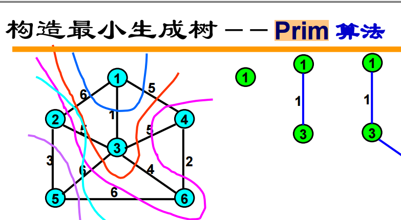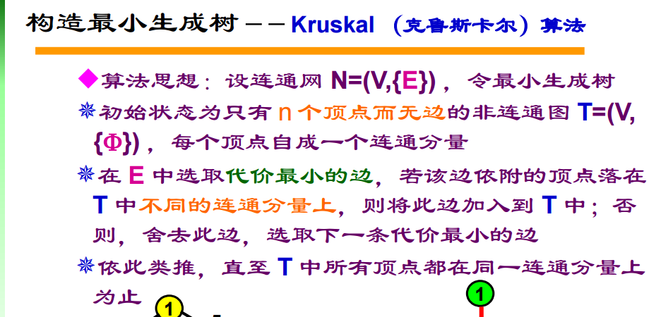
16. 二叉排序树结点的删除:
在二叉排序树（BST）中删除一个结点，其核心规则是：**删除该结点后，整棵树必须依然保持二叉排序树的性质**（即：任意结点的左子树中所有结点的值 < 该结点的值 < 其右子树中所有结点的值）。

为了实现这一点，删除操作通常根据被删除结点的子树数量，分为以下 **三种情况**：

---

### 情况一：被删除结点是叶子结点（没有子树）
*   **规则**：直接删除。
*   **操作**：将该结点的双亲结点指向它的指针域直接置为 `NULL`，然后释放该结点的内存。

### 情况二：被删除结点只有一个孩子（只有左子树或只有右子树）
*   **规则**：子承父业（独子继承）。
*   **操作**：用该结点的唯一孩子结点直接替换该结点。
    *   例如：若被删结点 $A$ 只有左孩子 $B$，则让 $A$ 的双亲结点直接指向 $B$，然后释放 $A$ 的内存。

### 情况三：被删除结点有两个孩子（既有左子树又有右子树）—— *核心考点*
*   **规则**：寻找“替身”来代替它，然后删除“替身”。
*   **操作**：
    为了尽量不破坏树的结构，我们需要在整棵树中找到最接近被删结点值的结点来作为“替身”。这个替身只有两种选择：
    1.  **前驱（Predecessor）**：**左子树中的最大结点**（即沿着左子树的右指针一直向下找，直到没有右孩子的结点）。
    2.  **后继（Successor）**：**右子树中的最小结点**（即沿着右子树的左指针一直向下找，直到没有左孩子的结点）。

    **标准步骤（以选择“后继”为例）**：
    1.  找到被删结点 $A$ 的右子树中的最左下结点 $S$（后继）。
    2.  将 $S$ 的值复制到 $A$ 中（此时 $A$ 的旧值被覆盖，相当于被删除了）。
    3.  此时问题转化为：删除结点 $S$。因为 $S$ 是最左下的结点，它**一定没有左孩子**，所以删除 $S$ 的操作直接退化为了**情况一**（它是叶子）或**情况二**（它只有右孩子），直接处理即可。
    4.  选前驱或者后继都可以.
17.   
18. 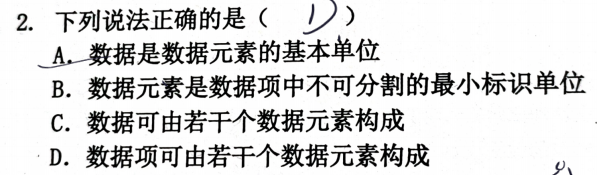
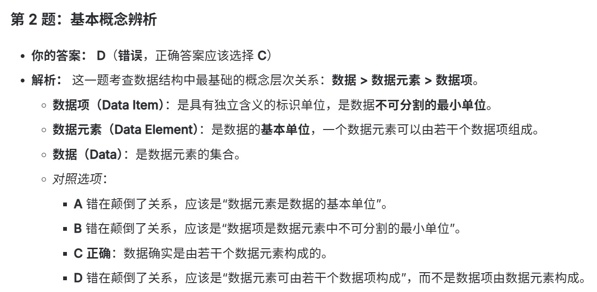
19. 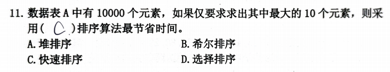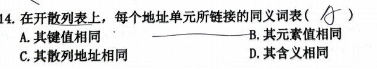
这组题（第 6 题到第 15 题）你做得非常好，绝大多数都答对了！

有 **1 道题确定做错（第 11 题）**，还有 **1 道题的手写字母有些模糊（第 14 题）**，可能是个高频易错坑。

下面是详细的批改和解析：

---

### **第 11 题：求海量数据中的前 $k$ 个最大元素（Top-K 问题）**
*   **解析（重点，这是考研/期末高频考点）：**
    *   题目要求：在 10000 个元素中，**仅**求出最大的 10 个元素。
    *   **为什么选 堆排序（A）？**
        *   我们可以建立一个大小仅为 10 的**小顶堆**。
        *   遍历这 10000 个元素，每次与堆顶元素比较，若比堆顶大，则替代堆顶并调整堆。
        *   遍历结束后，堆里的 10 个元素就是最大的 10 个。
        *   时间复杂度为 $O(N \log k)$（即 $10000 \log_2 10$），速度极快，且**省空间**。
    *   **为什么不选 快速排序（C）？**
        *   快速排序必须对全部 10000 个元素进行完整排序，时间复杂度是 $O(N \log N)$（即 $10000 \log_2 10000$）。在只需要前 10 个元素的情况下，全排序造成了极大的时间浪费。

---

### **第 14 题：散列表（哈希表）的同义词概念**
*   **正确答案：** **C. 其散列地址相同**
*   **批改提示：** 你的手写字母看起来有些像 A，也有些像 C。如果是 A，那就落入了经典陷阱：
    *   **陷阱解析：** 
        *   **同义词（Synonyms）的定义**：具有**不同键值**（Key）的元素，经过散列函数计算后，得到了**相同的散列地址**（即哈希值冲突）。
        *   例如：散列函数为 $H(key) = key \% 11$。
        *   键值 `14` 和 `25` 是不同的键值（所以 **A. 其键值相同** 是错的），但它们的散列地址都是 `3`（$14\%11 = 3$，$25\%11 = 3$）。
        *   它们会被链接在同一个地址单元 `3` 后面的拉链表（同义词表）中。因此，它们的**散列地址相同**（选 **C**）。


20. 队列允许插入的一段称为队尾 允许删除的一端称为队头
21. 后缀表达式处理括号与指数:指数转化为^运算符,括号自己安排顺序即可 
22. 平衡二叉树的旋转操作


### 绝招一：考场终极秒杀法——“提拔中间人”

这个方法不需要你脑补任何旋转动作，只需要做**大小排序**。

因为无论怎么旋转，二叉排序树的本质不会变：**左子树 < 根结点 < 右子树**。

对于任何失衡的三个关键结点（失衡结点、它的孩子、它的孙子），它们一定能排出一个“老大、老二、老三”的顺序。
**旋转的终极目标，就是把“老二（中间值）”提拔为新根，老大放右边，老三放左边。**

以你的题目为例，失衡处的三个结点是：`G`、`F`、`E`：
1. **排大小**：根据二叉排序树的性质（左小右大），由于 `F` 是 `G` 的右孩子，`E` 是 `F` 的左孩子，我们可以得出它们的大小关系是：
   $$G < E < F$$
   *（$E$ 比 $G$ 大，但比 $F$ 小）*
2. **提拔中间人**：这三个数中，**`E` 是中间值（老二）**。
3. **直接画出结果**：旋转后的局部结构必然是：**`E` 成为新根，小的 `G` 放左边，大的 `F` 放右边。**

```text
原结构 (RL型)：        秒杀结果：
     G (小)                 E (中)
      \                    / \
       F (大)            G(小) F(大)
      /
     E (中)
```
不论是 LL、RR、LR 还是 RL，这个“**提拔中间人**”的规则 $100\%$ 适用，考场上用它来画最终结果，只需 3 秒钟。

---

### 绝招二：直观物理记忆法——“拉直与下坠”

如果你在考试中被要求写出**“旋转过程的文字描述”**，可以用下面这个物理模型来记忆：

我们将失衡的形状分为两种：**“直线型”** 和 **“折线型”**。

#### 1. 直线型（LL 型 或 RR 型）—— 只需要“拉一把”
想象这三个结点是一根挂在空中的绳子。
*   **LL 型（一路向左倾斜）**：就像绳子往左边倒了。
    *   **动作**：用手捏住中间的结点，向上提；原来的根结点因为重力，**向右下坠**。
*   **RR 型（一路向右倾斜）**：绳子往右边倒了。
    *   **动作**：用手捏住中间的结点，向上提；原来的根结点因为重力，**向左下坠**。

```text
    (根) A              (提拔B，A往右下坠)          B
        /                                         / \
       B   <-- 捏住这里提上去                      C   A
      /
     C
```

#### 2. 折线型（LR 型 或 RL 型）—— “先拉直，再下坠”
折线型因为“打折”了，没法直接提。必须分两步：

*   **第一步：拉直（对孩子旋转）**
    *   以你的题目 **RL型**（`G -> F -> E`，往右再往左折）为例：
    *   下半部分 `F -> E` 是弯的，我们先揪住最底下的 `E` 往右边一拽，把它**拉直**成一条直直向右的线（`G -> E -> F`）。
    *   这就是文字描述中的：**对右孩子 F 进行“右单旋”**。

```text
      G                       G
       \       拉直下半部分     \
        F   -------------->     E
       /                         \
      E                           F  (拉直成了标准的 RR 型)
```

*   **第二步：下坠（对根旋转）**
    *   现在绳子已经变直了（`G -> E -> F`，一路向右倾斜）。
    *   我们按照“直线型”的方法：捏住中间的 `E` 往上一提，原来的根 `G` 顺势**向左下坠**。
    *   这就是文字描述中的：**对根结点 G 进行“左单旋”**。

```text
      G                                E
       \       捏住E上提，G左下坠        / \
        E   --------------------->   G   F
         \
          F
```


23.在考场上，**单纯靠“人脑模拟代码流程”确实极其容易想歪**。因为递归的调用栈很深，大脑在模拟回溯时负担很重，一旦在某个结点上直觉先行（比如觉得这棵树深度是4，而算出的数刚好也是4），就会陷入**“证实偏差”**，后面怎么看都觉得它是求深度的。

其实，阅读二叉树的递归算法有非常强烈的**“代码特征码（套路）”**。不需要人脑模拟，只需掌握 **“三步看穿法”**，就能一眼识破算法的真实意图。

### 第一步：看“左右结合处的运算符”（决定大方向）

拿到代码，先不看具体的 `if-else`，直接找 `f(left)` 和 `f(right)` 之间是用什么连起来的：

1.  **如果是加号 `+`** $\rightarrow$ **一定是“计数”或“求和”类算法**。
    *   因为只有计数才需要把左边算出来的数量，加上右边算出来的数量。
2.  **如果是 `max`（或 `>?` 或 三目运算符比较大小）** $\rightarrow$ **一定是“求高度/深度”或“求最值”类算法**。
    *   因为高度取决于左右子树中更深的那一个。
3.  **如果是逻辑运算符 `&&` 或 `||`** $\rightarrow$ **一定是“判断/判定”类算法**。
    *   比如：判断两棵树是否相等、判断是否是平衡二叉树、判断是否是完全二叉树。

> **考场应用**：这道题一看到 `f42(left) + f42(right)` 里的 **`+`**，在 1 秒钟内就应该排除“求深度”的可能，判定它是在**“数个数”**。


### 第二步：看“过滤条件”（决定目标是谁）

既然大方向是“数个数（计数）”，那它数的是什么结点的个数？直接去代码里找 **`+1`** 发生在哪里（哪个 `if` 语句触发了 `+1`）：

二叉树只有三种结点的指标最常考：
1.  **如果条件是 `!root->left && !root->right`**
    *   $\rightarrow$ 数的是**叶子结点（度为 0 的结点）**个数。
2.  **如果条件是 `(left && !right) || (!left && right)`**
    *   $\rightarrow$ 数的是**单分支结点（度为 1 的结点）**个数。
3.  **如果条件是 `root->left && root->right`**
    *   $\rightarrow$ 数的是**双分支结点（度为 2 的结点）**个数。
4.  **没有条件，每层都 `+1`（即 `return d + 1` 始终执行）**
    *   $\rightarrow$ 数的是**总结点个数**。
5.  **条件是 `root->data == x`**
    *   $\rightarrow$ 数的是**值为 $x$ 的结点个数**。

> **考场应用**：这道题代码里写着 `if (tree->left && tree->right) return d + 1;`，显然符合第 3 条。


### 第三步：看“空树边界”（验证猜想）

看第一行：`if (!tree) return 0;`。
*   如果是空树，返回 `0`。
*   这完美符合“计数”的初始边界（没结点可数，自然是 0）。
\
24. 先序 中序 后序 知道哪几个可以确定该二叉树?
在数据结构考试中，这是一个非常经典的**高频核心考点**。

一句话死记硬背的黄金法则：**“必须包含中序遍历，才能唯一确定一棵二叉树。”**

---

### 一、 可以唯一确定的组合：
只要有**中序**，搭配另外任意一个遍历，就可以唯一确定一棵二叉树。
1.  **先序（前序） + 中序** （最常考）
2.  **后序 + 中序** （最常考）
3.  **层序 + 中序** 

---

### 二、 不能唯一确定的组合：
*   **先序 + 后序** （**绝对不能**唯一确定！）
*   **先序 + 层序**
*   **后序 + 层序**

---

### 💡 考场必背：为什么“先序 + 后序”不能唯一确定？

如果考卷上出现大题让你解释为什么，或者考查概念，你只需要画出下面这个**最极端的 2 结点反例**：

假设一棵树有 `A`、`B` 两个结点：

*   **树 1**（`B` 是 `A` 的左孩子）：
    ```text
          A
         /
        B
    ```
    *   先序序列：`A B`
    *   后序序列：`B A`

*   **树 2**（`B` 是 `A` 的右孩子）：
    ```text
        A
         \
          B
    ```
    *   先序序列：`A B`
    *   后序序列：`B A`

这两个二叉树的**先序和后序完全一模一样**，但一个是左斜树，一个是右斜树，形态完全不同。所以，**只有先序和后序是无法确定唯一的二叉树的**。

（*注：先序决定了“谁是根”，而后序决定了“谁是子树”，但它们都没法区分这个子树到底是“左子树”还是“右子树”；只有中序能用左、右关系强行把它们划分开来。*）

25. 稀疏矩阵的压缩存储
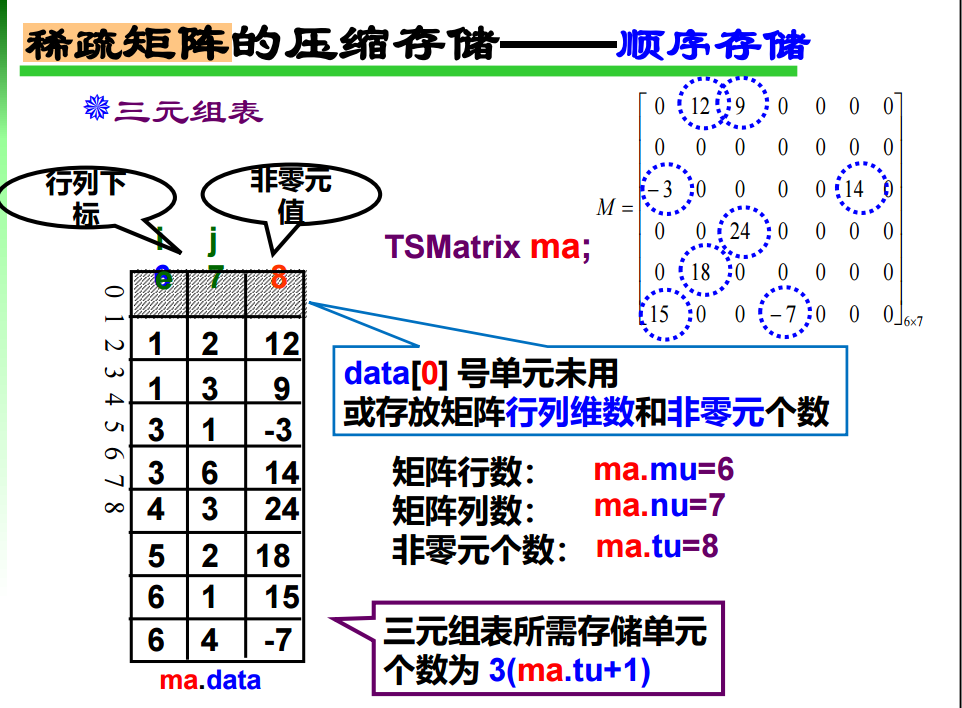
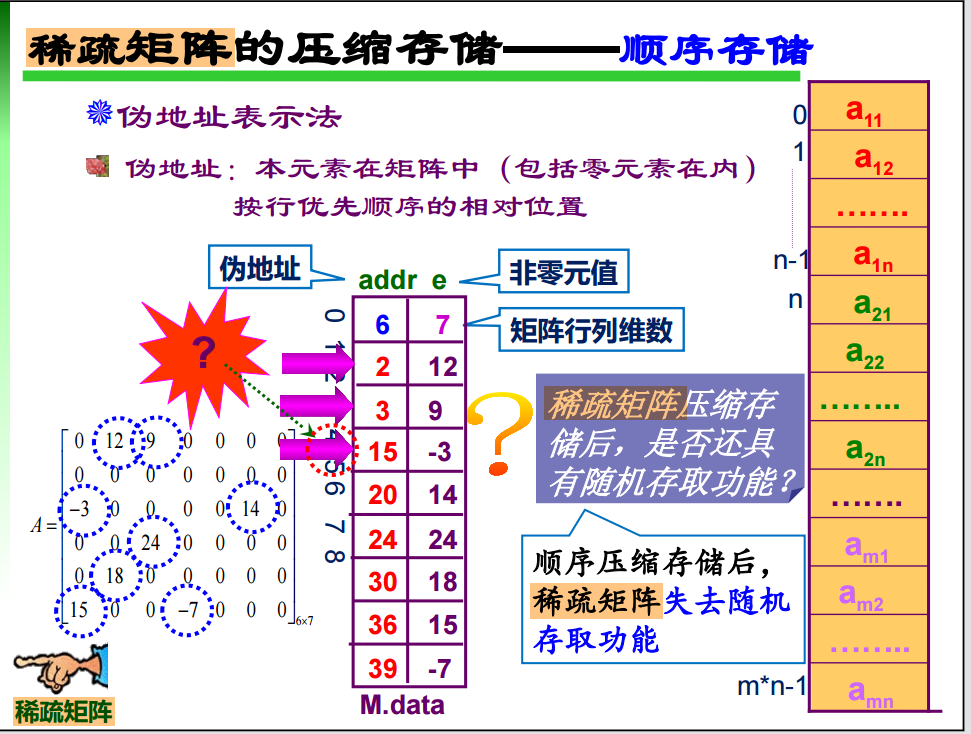
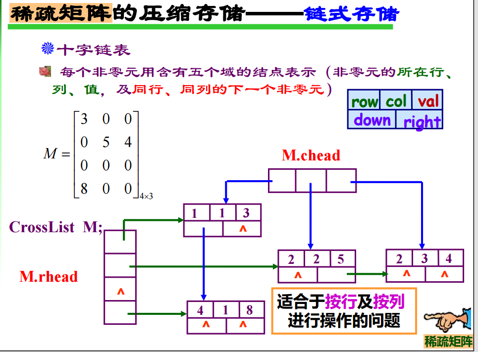
26. 求最短路径两大算法: Djikstra Floyd

为了让你在考试中能够流畅地写出大题的每一步步骤（比如手动填表、画出状态转移过程），下面我们不作对比，**纯粹从算法的“执行流程（状态变化）”来精细拆解这两个算法**。

---

### 一、 迪杰斯特拉（Dijkstra）算法的执行流程

Dijkstra 的核心流程可以概括为：**“选矮子 $\to$ 锁死它 $\to$ 借它搭桥往外探”**。

#### 1. 算法依赖的三个辅助工具（考试填表大题的核心）
在执行过程中，算法必须维护三个数组：
1.  `dist[i]`：源点（起点）到顶点 $i$ 的**当前已知最短距离**。
2.  `s[i]`：标记数组（布尔值），`true` 表示顶点 $i$ 的最短路径已经**确定锁死**；`false` 表示还在探索中。
3.  `path[i]`：前驱数组，记录到达顶点 $i$ 的**前一个顶点**（用来输出最终路径）。

---

#### 2. 详细执行步骤（以源点为 $v_0$ 为例）

##### **【第一步：初始化】**
*   将起点 $v_0$ 的 `dist[v_0]` 设为 `0`，`s[v_0]` 设为 `true`（直接锁死）。
*   其他顶点的 `dist[i]` 初始化为：
    *   若 $v_0$ 与 $i$ 有直接边，则 `dist[i] = 边权值`。
    *   若无直接边，则 `dist[i] = ∞`。
*   将所有非起点的 `s[i]` 设为 `false`。

##### **【第二步：循环找点与更新】（此步需重复执行 $N-1$ 次，对应表格的每一行）**
在未锁死的顶点（即 `s[i] == false`）中，进行以下操作：

1.  **【选点】**：找出 `dist[i]` 值最小的顶点 $u$。（俗称“找目前离起点最近的未确定点”）。
2.  **【锁死】**：将该顶点 $u$ 锁死，设置 `s[u] = true`。（此时，$v_0$ 到 $u$ 的最短路径已焊死，后面绝不更改）。
3.  **【松弛（更新邻居）】**：以刚锁死的 $u$ 为中转站，检查 $u$ 的所有**未锁死**的邻居 $v$：
    *   **算一下新距离**：起点到 $u$ 的距离 `dist[u]` + 边 `weight(u, v)` 的权值。
    *   **比大小**：如果 `dist[u] + weight(u, v) < dist[v]`：
        *   **更新它**：`dist[v] = dist[u] + weight(u, v)`；
        *   **记下路**：`path[v] = u`（表示到 $v$ 的路现在要经过 $u$）。

##### **【第三步：算法结束】**
当所有的顶点都被锁死（`s` 全部为 `true`），算法结束。此时的 `dist` 数组就是源点到所有点的最短距离。

---

### 二、 弗洛伊德（Floyd）算法的执行流程

Floyd 的核心流程可以概括为：**“插点法”**。它通过**逐个引入中间结点**来不断刷新任意两点间的距离。

#### 1. 算法依赖的两个矩阵
Floyd 算法整个执行过程中都在更新两个 $N \times N$ 的矩阵：
1.  **距离矩阵 $D$**：$D[i][j]$ 表示当前从顶点 $i$ 到 $j$ 的最短路径长度。
2.  **路径矩阵 $P$**：$P[i][j]$ 记录从 $i$ 到 $j$ 经过的中间结点（用于重构路径）。

---

#### 2. 详细执行步骤

##### **【第一步：初始矩阵 $D^{(-1)}$】**
*   直接根据图的邻接矩阵建立初始矩阵 $D^{(-1)}$。
*   $D[i][j]$ 的初始值为：
    *   若 $i = j$，则为 `0`（自己到自己）。
    *   若 $i$ 与 $j$ 有直接边，则为该边的权值。
    *   若无直接边，则为 `∞`。

##### **【第二步：动态插入中间点（核心循环）】**
算法进行 $N$ 轮迭代。在第 $k$ 轮迭代中（$k$ 从 $0$ 变到 $N-1$），我们要**允许顶点 $v_k$ 作为中转站**。

这时的代码结构是经典的三重循环：
```cpp
for (int k = 0; k < N; k++) {          // 外层：必须是允许插入的中间点 vk
    for (int i = 0; i < N; i++) {      // 中层：起点 vi
        for (int j = 0; j < N; j++) {  // 内层：终点 vj
            
            // 核心判断：如果经过 vk 中转比原来的直达更近
            if (D[i][k] + D[k][j] < D[i][j]) {
                D[i][j] = D[i][k] + D[k][j];  // 刷新距离
                P[i][j] = k;                  // 记录中间中转点
            }
            
        }
    }
}
```

##### **【第三步：如何理解这 $N$ 轮迭代的变化？】**
假设图有 A, B, C 三个点：

*   **第 1 轮迭代（$k=0$，引入 A）**：
    *   全图扫描，看任意两点 $i$ 和 $j$，如果走 $i \to A \to j$ 比原直接路径短，就更新 $D[i][j]$。此时得到矩阵 $D^{(0)}$（表示**只允许以 A 为中转站**时的最短路径）。
*   **第 2 轮迭代（$k=1$，引入 B）**：
    *   在 $D^{(0)}$ 的基础上继续扫描，看如果走 $i \to B \to j$ 是不是更近。此时得到矩阵 $D^{(1)}$（表示**允许以 A, B 为中转站**时的最短路径）。
*   **第 $N$ 轮迭代（引入所有点）**：
    *   当最后一个顶点被允许作为中转站后，矩阵 $D^{(N-1)}$ 被计算出来。此时，矩阵中的每一个元素都是全局真正的最短距离。

---

### ⚠️ 考试极其容易扣分的细节提醒：

1.  **Dijkstra 选点后的“锁死”步骤**：
    在大题手写步骤时，确定了当前最短的 `dist[u]` 之后，在下一步更新邻居前，**一定要写明将 $u$ 加入到 `S` 集合中**。有很多同学光顾着改数值，忘了写 `s[u]=true`。
2.  **Floyd 三重循环中 $k$ 必须在最外层**：
    如果考你 Floyd 的伪代码填空，**最外层的循环变量必须是中转点 $k$**。如果把 $i$ 或 $j$ 放在最外层，算法的逻辑就彻底废了，因为你必须保证在计算 $i \to j$ 之前，通过 $k$ 中转的所有可能性已经完全计算完毕。
27. 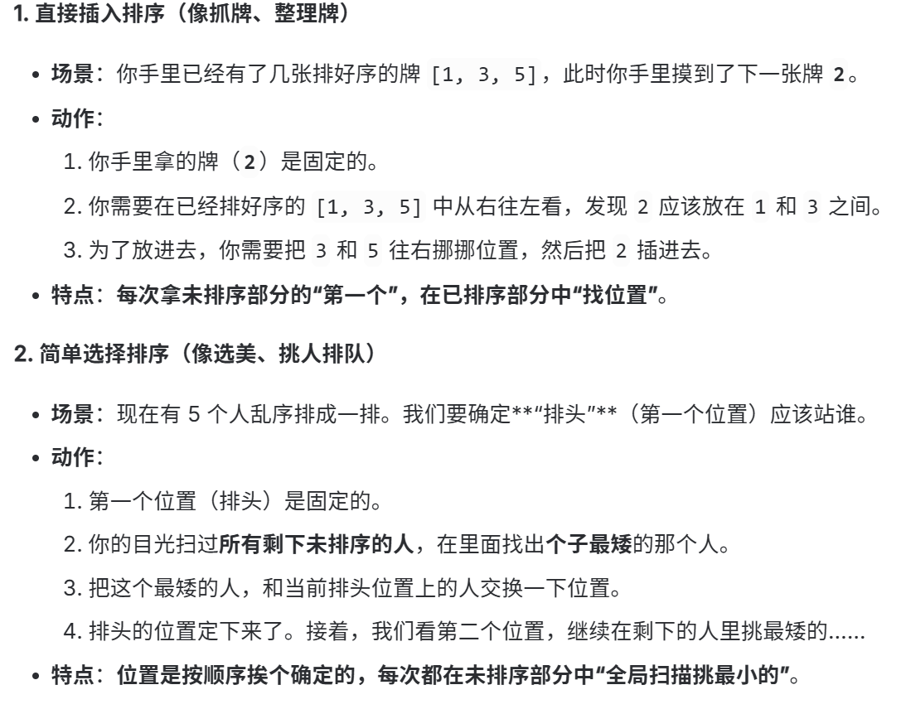
28. 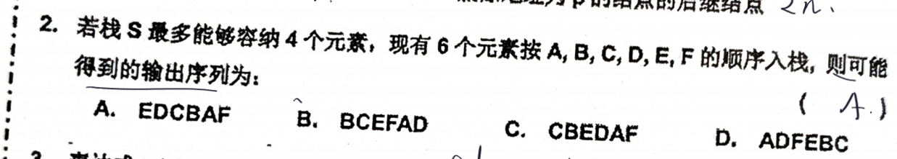
栈居然有最大容量上限 这个选C才是对的
29. 错题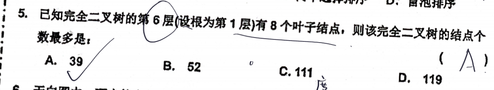
30. 错题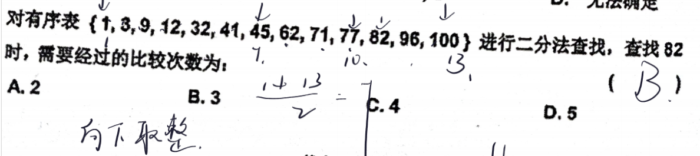
   
31. 简单选择排序:直接交换 插入排序:插入,不是交换位置
32. 栈算法计算拓扑序列:
   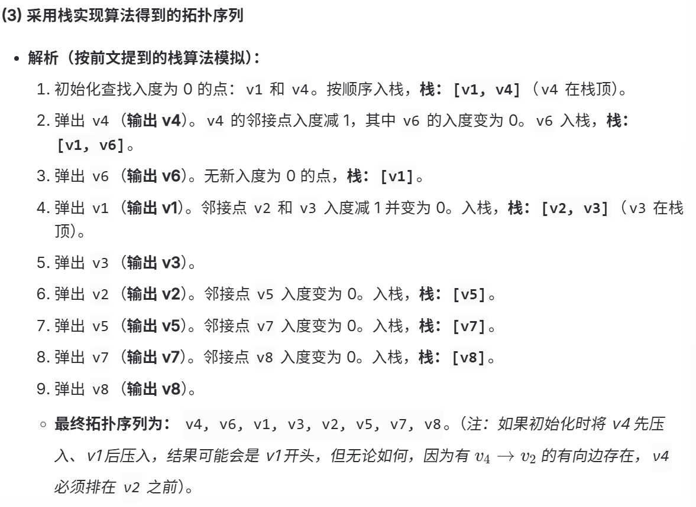
33.循环队列:   元素个数: (rear-front+m)%m
               判断队列满:(rear+1)%m = front
34. 
35. 查找方法对比

### 静态查找与动态查找方法比较表

| 查找分类 | 查找方法 | 平均时间复杂度 (ASL) | 最坏时间复杂度 | 辅助空间复杂度 | 存储结构与前提条件 | 优缺点及适用场景 |
| :--- | :--- | :--- | :--- | :--- | :--- | :--- |
| **静态查找** | **顺序查找** | $O(n)$<br>*(成功时 $ASL \approx \frac{n+1}{2}$)* | $O(n)$ | $O(1)$ | 顺序表或链表均可；<br>对元素是否有序**无要求**。 | 算法最简单，但效率低；<br>适用于表长较小或无序的线性表。 |
| **静态查找** | **折半查找** *(二分查找)* | $O(\log_2 n)$<br>*(成功时 $ASL \approx \log_2(n+1)-1$)* | $O(\log_2 n)$ | $O(1)$<br>*(递归时为 $O(\log_2 n)$)* | **必须采用顺序存储**（数组）；<br>**元素必须按大小有序排列**。 | 查找速度极快；<br>但不适合频繁插入和删除（因为要维护有序性）。 |
| **静态查找** | **分块查找** *(索引顺序查找)* | $O(\sqrt{n})$<br>*(均匀分块且两级均顺序查找时，最佳 $ASL \approx \sqrt{n}+1$)* | $O(b+s)$<br>*($b$为块数，$s$为块内元素数)* | $O(b)$<br>*(需要额外建立一个大小为 $b$ 的索引表)* | **“块间有序，块内无序”**；<br>索引表必须有序，块内可无序。 | 折中方案。既有较快的查找速度，<br>又比较方便进行块内的插入和删除。 |
| **动态查找** | **二叉排序树 (BST)** | $O(\log_2 n)$ | $O(n)$<br>*(当树退化为单支树/链表时)* | $O(1)$<br>*(递归时为 $O(h)$， $h$为树高)* | 二叉链表存储。 | 插入和删除非常快（无需移动大量元素）；<br>但查找性能不稳定，受输入序列顺序影响极大。 |
| **动态查找** | **平衡二叉树 (AVL)** | $O(\log_2 n)$ | $O(\log_2 n)$<br>*(通过旋转强制维持树高平衡)* | $O(1)$<br>*(递归时为 $O(\log_2 n)$)* | 二叉链表存储（结点需记录平衡因子）。 | 查找性能极高且非常稳定；<br>但在插入和删除时，需要通过旋转来维护平衡，有额外开销。 |
还有个哈希查找, 时间复杂度为O(1).

36. 一些B-树:
### ⏱️ B-树考前极简速记卡

#### 1. 核心规律与特征
* **绝对平衡**：所有叶子结点都在同一层。
* **基本规律**：**孩子数 = 关键字数 + 1**。

#### 2. 数量范围约束（以 $m$ 阶为例）
*(极高频考点，记公式)*

| 结点类型 | 关键字（数字）个数范围 | 孩子（分叉）个数范围 |
| :--- | :--- | :--- |
| **根结点** | $1 \sim m-1$ | $2 \sim m$ |
| **非根/非叶结点** | **$\lceil m/2 \rceil - 1 \sim m-1$** | **$\lceil m/2 \rceil \sim m$** |

*(5阶B树速算示例：$\lceil 5/2 \rceil = 3$。非根结点关键字范围为 $[2, 4]$ 个，孩子范围为 $[3, 5]$ 个。)*

#### 3. 操作精髓
* **插入**：永远只插在最底层叶子。数量超限（$> m-1$）则**分裂**（中间数上提，左右分裂）。
* **删除**：数量太少（低于下限）则进入饥荒：
  * **借**：兄弟富裕，通过父亲**旋转**借一个。
  * **并**：兄弟也穷，进行**合并**（我 + 夹在中间的父亲 + 兄弟 融合成一个）。

#### 4. B树 与 B+树 的终极区别
* **B-树**：所有结点都存数据，叶子结点互不相连。
* **B+树**：**只有叶子结点存数据且链表相连**（利于范围查询）；**孩子数 = 关键字数**。
37. 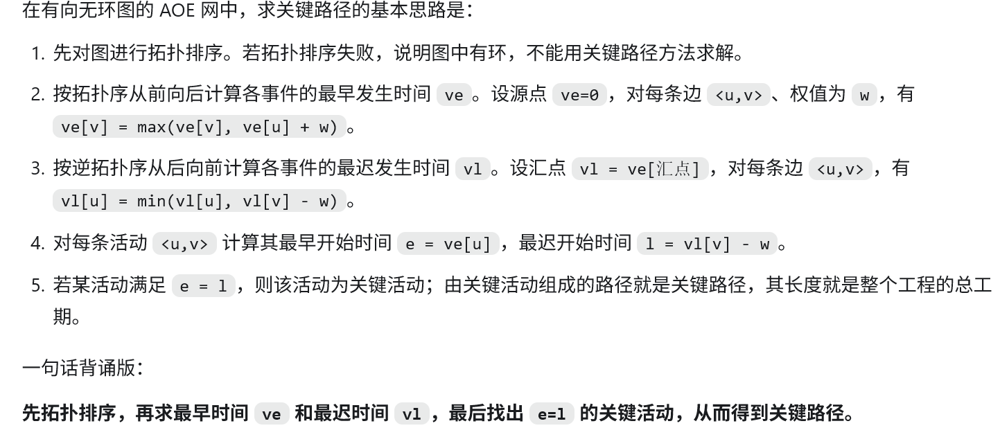
38. AOE网中的关键路径:它是从起点到终点“耗时最长”的路径，但它决定了整个项目“最快能完工”的时间（即最短工期）。
39. *luminous*
40. 定义一个抽象数据类型
   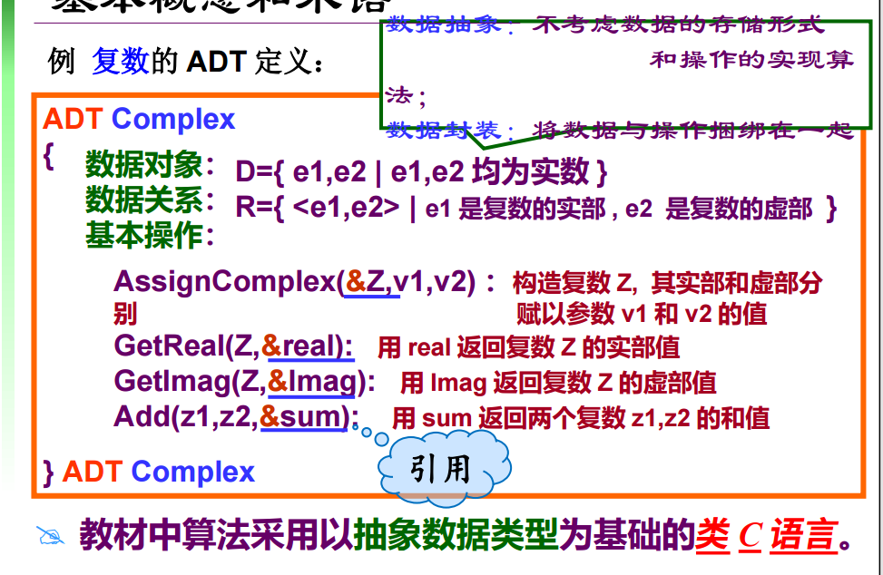
ADT需要有哪些功能? 满足"生死读写"的功能,再根据结构特点调整功能即可,比如栈的push pop,线性表getidx
41. 循环队列队满:(r + 1)%m = f 
   队空: r=f
   循环队列元素个数: (r - f + m) % m
42. 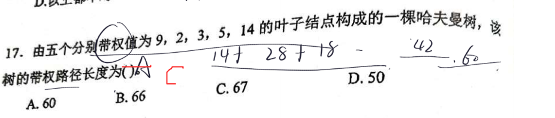
画出树的结构如下：
```text
        (33)
       /    \
     14     (19)
           /    \
          9     (10)
               /    \
              5     (5)
                   /   \
                  2     3
```
*(注：圆括号内为非叶子结点，其余为叶子结点)*

---

### 第二步：计算 WPL 的两种方法

#### 方法一：定义法（计算每个叶子结点的 权值 × 路径长度）
* 叶子 `14` 的层数（路径长度）为 1 $\rightarrow 14 \times 1 = 14$
* 叶子 `9` 的层数（路径长度）为 2 $\rightarrow 9 \times 2 = 18$
* 叶子 `5` 的层数（路径长度）为 3 $\rightarrow 5 \times 3 = 15$
* 叶子 `2` 的层数（路径长度）为 4 $\rightarrow 2 \times 4 = 8$
* 叶子 `3` 的层数（路径长度）为 4 $\rightarrow 3 \times 4 = 12$

$$\text{WPL} = 14 + 18 + 15 + 8 + 12 = 67$$

---

#### 方法二：考试提速大招（非叶子结点权值之和）⭐
在哈夫曼树中，**带权路径长度（WPL）等于所有非叶子（分支）结点的权值之和**。

我们只需把合并过程中产生的**所有新结点（非叶子结点）**相加即可：
* 第一次产生的新结点：`5`
* 第二次产生的新结点：`10`
* 第三次产生的新结点：`19`
* 第四次产生的新结点：`33`

$$\text{WPL} = 5 + 10 + 19 + 33 = 67$$
43. hash表处理冲突的几种方法:
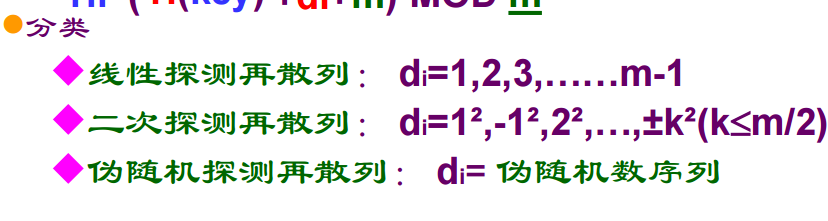
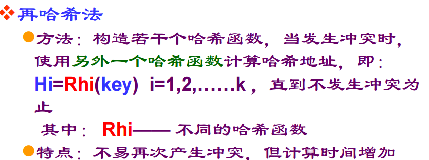
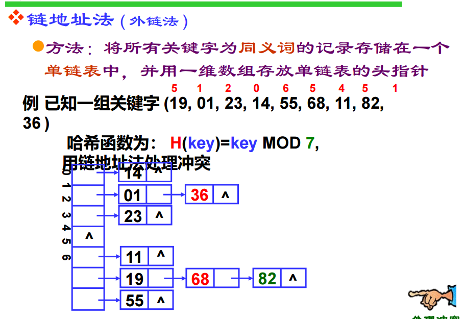
44. 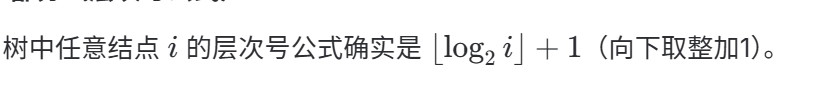
45. 算法可以没有输入 但是必须有输出
46. 还是旋转:太理解了！教科书上那种“以某某为轴左旋转”、“顺时针/逆时针”的说法确实非常反人类。考试时间本来就紧，在草稿纸上转来转去极易转晕、转错。

为了明天顺利通关，我教你一套**根本不需要任何空间想象力、纯靠大小排序的“傻瓜式解题大招”**。

这套方法叫：**“中间数提拉法”**。

---

### 第一步：找出“惹祸”的三个结点（三叉排序法）

不管是什么 LL、RR、LR、RL，导致树不平衡的永远只有**三个结点**：
* **A**：不平衡的那个祖先结点（平衡因子变成 2 或 -2 的那个）。
* **B**：它的儿子。
* **C**：它的孙子（新插入的那一边）。

比如你刚才错的那一步，这三个结点就是：`7`、`5`、`6`。

---

### 第二步：不用旋转，直接写出“最终平衡形态”

把这三个数按大小排个序：
$$5 < 6 < 7$$

* **无脑规则**：
  * **中间那个数（6）** 永远当老大（子树的根）。
  * **最小的那个数（5）** 永远在左边。
  * **最大的那个数（7）** 永远在右边。

所以，最后的平衡形态必定是：
```text
    6
   / \
  5   7
```
**不需要想象任何旋转，直接按大小把中间的数提上去就行了！**

---

### 第三步：怎么画“中间过渡状态”？（专治 LR / RL）

如果是 **LL 型**或 **RR 型**（本来就是一条直线），是不需要中间状态的，一步到位。
只有 **LR 型**和 **RL 型**（折线型）才需要画出中间状态。

怎么画中间状态？同样不需要想象，直接记公式：

#### 情况 1：LR 型（先左后右折线，如 7 -> 5 -> 6）
* **无脑公式**：中间状态一定是**向左倾斜的直线（LL型）**。
* **怎么画**：按大小，最大的在最上面，中间的在中间，最小的在最下面。
```text
      最大 (7)
      /
    中间 (6)
    /
  最小 (5)
```
*(你刚才就是这里画错了一条线的方向，只要记住 LR 的中间态一定是“纯左斜线”即可。)*

#### 情况 2：RL 型（先右后左折线，如 5 -> 7 -> 6）
* **无脑公式**：中间状态一定是**向右倾斜的直线（RR型）**。
* **怎么画**：按大小，最小的在最上面，中间的在中间，最大的在最下面。
```text
  最小 (5)
    \
    中间 (6)
      \
      最大 (7)
```

---

### 第四步：如果这三个结点还拖着其他“油瓶”（子树）怎么办？

考试时，有时这三个结点底下还挂着别的子树。
旋转完之后，这些子树该挂在哪里？

* **无脑口诀：谁没位置了，就按“左小右大”的二叉排序树规则，塞进空位里。**

比如，`6` 升级当了老大，`5` 变成了 `6` 的左孩子，`7` 变成了 `6` 的右孩子。
* 如果原本 `6` 还有一个左子树 $T_1$，因为 $5 < T_1 < 6$，所以 $T_1$ 只能挂在 `5` 的右边。
* 如果原本 `6` 还有一个右子树 $T_2$，因为 $6 < T_2 < 7$，所以 $T_2$ 只能挂在 `7` 的左边。

---

### 总结明天的解题流程：
1. 插入新结点。
2. 算平衡因子，找到最下面的那个不平衡结点 $A$。
3. 顺着新插入的方向，抓出 $A, B, C$ 三个数。
4. 把这三个数排序：小、中、大。
5. **最终状态**：直接画成 `中` 在上，`小` 在左，`大` 在右。
6. **中间状态（如果是折线）**：直接画成一根直棍子（小中大排好队）。

用这套方法，闭着眼睛都能写对，今晚可以睡个好觉了！
47. 有向无环图的关键路径的算法设计思路:
   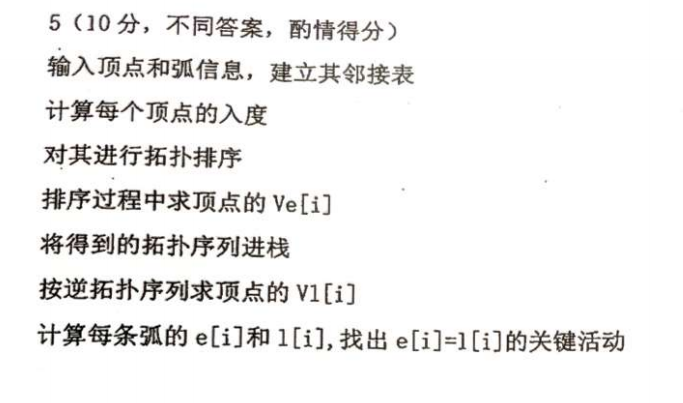
48. n个结点的无向图中: 
    使该图**可以**成为连通图的最小边数: n-1 即构建一个树
      使该图**必然**连通的最小边数: $(n-1)(n-2)/2 + 1$
49. 线索二叉树
    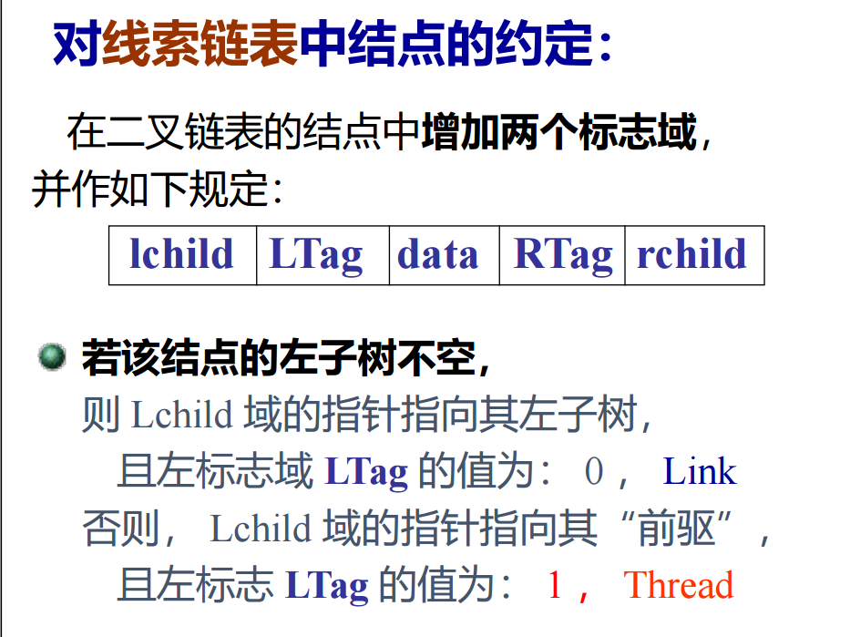
50. 判断序列是不是堆? 计算下标即可. 2i 2i+1
51. 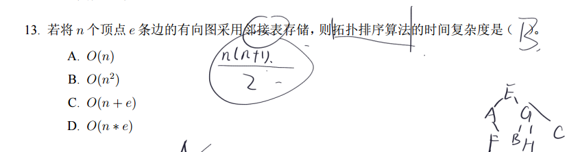
   答案应为C
52. 希尔排序的流程概述
### 问题 1：万一 $d$ 不是总元素个数 $n$ 的因数怎么办？

**答案：完全没有任何影响。分组依然正常进行，只不过有的组会多一个数，有的组会少一个数。**

在希尔排序中，组与组之间的元素个数**不一定非要相等**。

#### 🌰 举个例子：
假设有 **10 个元素**（下标 0 ~ 9），增量 $d = 3$（10 显然不能被 3 整除）。
我们依然每隔 3 个数划分为一组：

* **第 0 组**（下标 $0, 3, 6, 9$）：共有 **4** 个元素。
* **第 1 组**（下标 $1, 4, 7$）：共有 **3** 个元素。
* **第 2 组**（下标 $2, 5, 8$）：共有 **3** 个元素。

**操作方法一模一样**：
1. 第 0 组（4个数）自己在组内排好序，放回原位。
2. 第 1 组（3个数）自己在组内排好序，放回原位。
3. 第 2 组（3个数）自己在组内排好序，放回原位。

所以，不能整除是常态，不用担心，直接无脑往后数 $d$ 个隔空取数即可。

---

### 问题 2：第一趟之后的过程如何？

希尔排序之所以叫“缩小增量排序”，就是因为**它的增量 $d$ 是每趟都在缩小的，直到最后一趟 $d=1$ 为止**。

#### 1. 增量 $d$ 是如何缩小的？
在期末考试中，增量序列通常有两类给法：
* **第一种（题目直接给出）**：比如题目会说“增量序列依次为 5, 3, 1”。
* **第二种（无脑折半法，最常见）**：如果题目没给，默认下一趟的增量就是上一趟的**一半（向下取整）**。
  * 比如：第一趟 $d_1 = 5$，第二趟就是 $d_2 = \lfloor 5/2 \rfloor = 2$，第三趟就是 $d_3 = \lfloor 2/2 \rfloor = 1$。

#### 2. 后续每趟的操作细节（必须基于前一趟的结果）：
**最容易犯错的考点**：**第二趟排序，必须在第一趟排序出来的“新序列”基础上进行，绝对不能用原序列！**

流程如下：
* **第一趟**：用 $d_1$ 对原序列分组并排序，得到新序列 $A_1$。
* **第二趟**：用新增量 $d_2$ 对**序列 $A_1$** 进行分组并排序，得到新序列 $A_2$。
* **最后一趟（必须是 $d = 1$）**：用 $d=1$ 对上一趟的结果进行**直接插入排序**。
  * *为什么最后一趟是 $d=1$？* 因为 $d=1$ 就是不分组了，对全体进行一次普通的插入排序。
  * *这有什么用？* 此时序列已经“基本有序”了，直接插入排序在“基本有序”的情况下时间复杂度接近 $O(n)$，速度极快。最后输出的就是完全有序的最终结果。
53. 